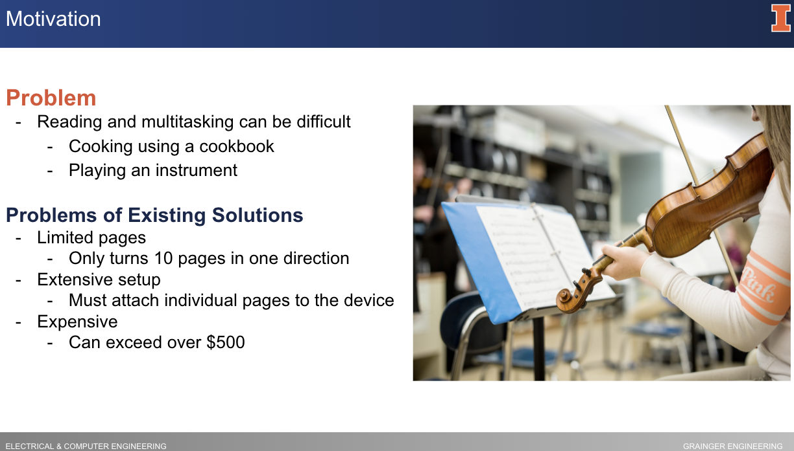
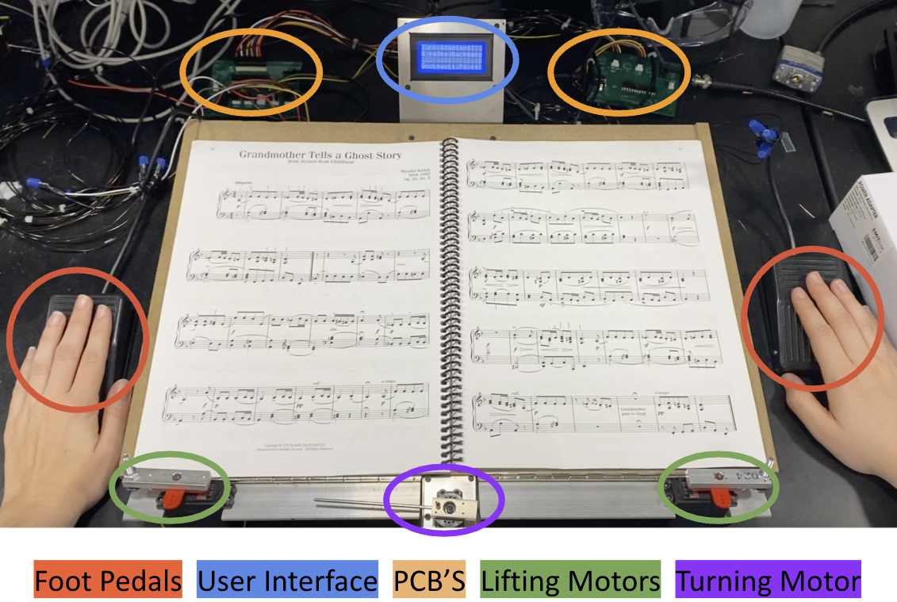
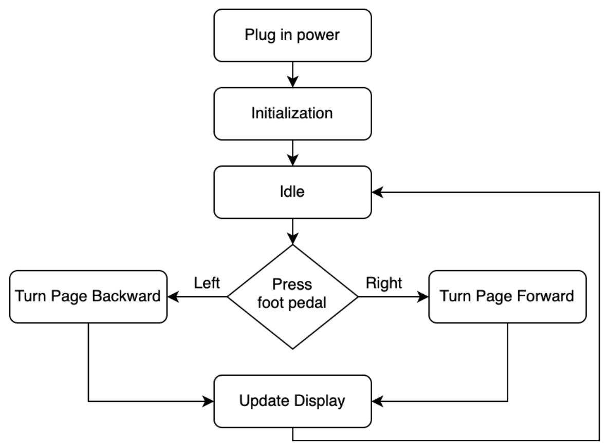
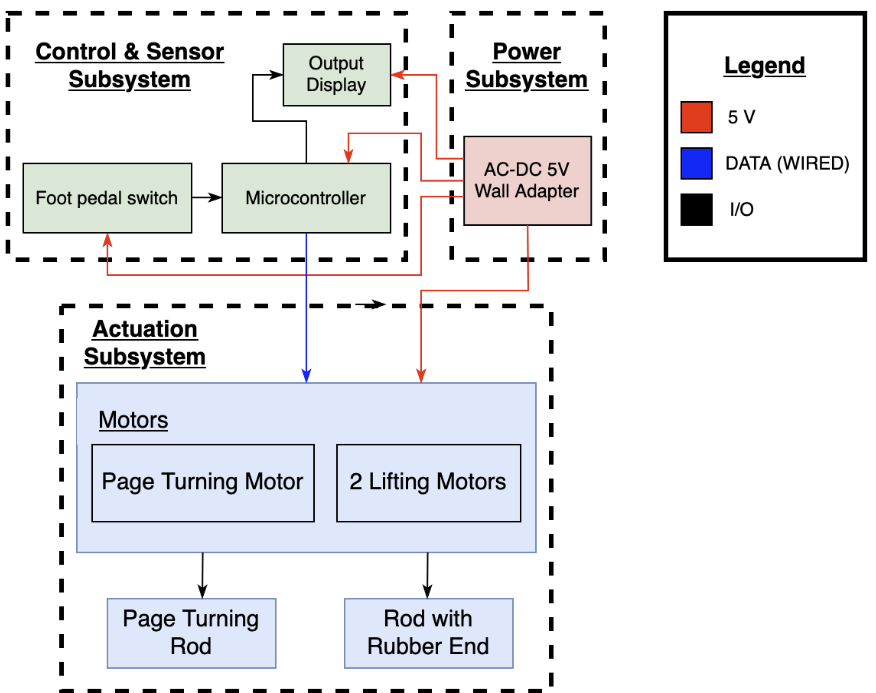
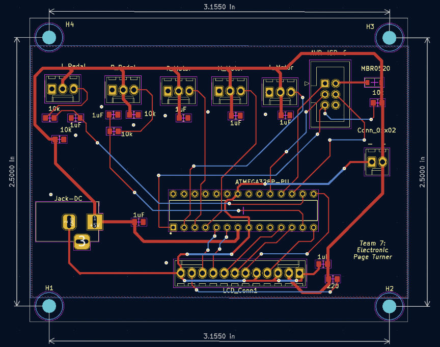

# Sheet Music Page Turner

This page-turning device was designed with reading and multitasking in mind. While devices for eBooks already exist, our solution primarily aimed to provide a cheaper hands-free alternative for physical sheet music books.

  <h2>Minimum Viable Product</h2>

Our page turner uses two foot pedals as input and three servo motors to turn pages forward or backward. The servo motors are attached to the base of a wooden stand and a liquid crystal display (LCD) is mounted to a metal enclosure.

Ultimately, the device was successfully able to turn pages in both directions, consecutively turn up to 10 pages in a row, and digitally track the number of pages the user turned.

**Note:** Feel free to take any inspiration, but this code was not intended to be cloned and deployed. As such, I do not provide support or guidance for this.

  <h2>Software Flow Chart</h2>
  

  <h2>Block Diagram</h2>
  

  <h2>Circuit Schematic</h2>
  

  <h2>Printable Circuit Board (PCB) Diagram</h2>
  

