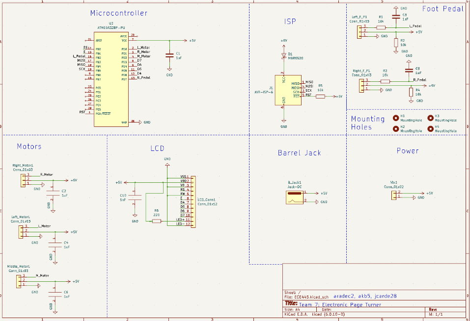

# Music Sheet Page Turner

Our Music Sheet Page Turner was designed with reading and multitasking in mind. While devices for eBooks already exist, our solution aimed to provide a cheaper hands-free page-turning device for physical books.

Our page turner uses two foot pedals as input and three servo motors to turn pages forward or backward. The servo motors are attached to the base of a wooden stand and a liquid crystal display (LCD) is mounted to a metal enclosure.

Ultimately, our device was successful in turning pages in both directions, consecutively turning up to 10 pages in a row, and digitally track of how many pages the user has turned.

Note: Feel free to take any inspiration, but this code was not intended to be cloned and deployed. As such, I do not provide support or guidance for this.

